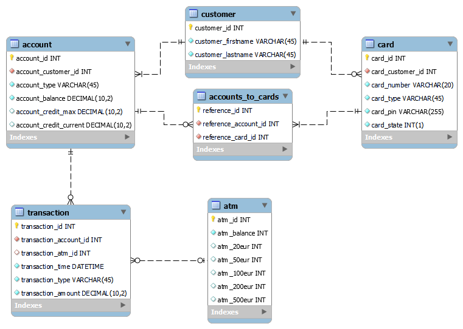

# SPO_Group9

Pankkiautomaattiprojektissa on tarkoituksena luoda simulaatio pankkiautomaatin toiminnasta. 

## Tietokannan malli
 Hyväksytty tietokannan malli on lisättynä alla olevassa kuvassa. 
</img>
 
## Lisäominaisuus ADMIN tila
Lisäominaisuuteen on tarkoitus luoda pankkiautomaatille setelien hallintaa. 
Lopullinen muoto muuttuu sen mukaan, mihin lopulta aika riittää. 

## Jäsenet
[Marko Oravisjärvi](https://github.com/moravis) 
[Jere Kortesalmi](https://github.com/JereKortesalmi) 
[Timo Pesola](https://github.com/timopesola) 
[Arto Peurasaari](https://github.com/artopeu) 